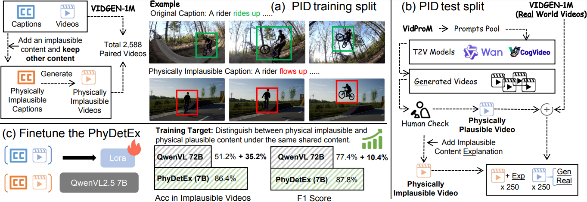

#  PhyDetEx: Detecting and Explaining the Physical Plausibility of T2V Models

Official repository for the paper ["VideoVerse: How Far is Your T2V Generator from a World Model?"](https://arxiv.org/abs/2510.08398).

[📖 Paper]( ) [🤗 PID Dataset](https://huggingface.co/datasets/NNaptmn/PhyDetExDatasets) [🤗 PhyDetEx Model](https://huggingface.co/NNaptmn/PhyDetEx) 

## 🔥 News
- **[2025.12.01]** 🔥 We release the PID Dataset and the PhyDetEx Model!

## Introduction

PhyDetEx is a model designed for detecting physical implausible content. Additionally, to better address and test physical implausible content detection, we provide the PID Physical Implausibility Detection dataset.



## 🔧 How to Start

### Download the PID Test split

Download `PID_Test_split.zip` from [🤗 PID Dataset](https://huggingface.co/datasets/NNaptmn/PhyDetExDatasets), place it in the `Data/PID_test` directory, and organize it as follows:
PID_test/
    pos/
        video_xxx.mp4
        ......
    neg/
        video_xxx.mp4
        ......
    anno_file.json
```

### Download the PhyDetEx

Download PhyDetEx from [🤗 PhyDetEx Model](https://huggingface.co/NNaptmn/PhyDetEx).

### Prepare the Environment

```bash
pip install -r requirements.txt
```

Please note that the version of transformers may affect specific metrics, so it is recommended to use the version specified in requirements.txt.

### Set variables
In benchmark_on_pid_test_split.py, set the corresponding path for PhyDetEx, then run:
```
python benchmark_on_pid_test_split.py
```
The resulting ./res/res_on_pid_test.json will contain the F1 Score, Acc Plausible, and Acc Implausible.

### Get the reasoning score
Deploy any LLM using [lmdeploy](https://github.com/InternLM/lmdeploy). In the paper, we report results using LLaMa3 8B.

In infer_llm_score_for_pid_test_lmdeploy.py, set the corresponding port and evaluation file path, then run:

```
python infer_llm_score_for_pid_test_lmdeploy.py
```

### 🧪 Test on ImpossibleVideos

You can download and process the Physical Law-related data from [Impossible-Videos](https://github.com/showlab/Impossible-Videos). Alternatively, we recommend directly downloading our preprocessed data: [🤗 PID Dataset](https://huggingface.co/datasets/NNaptmn/PhyDetExDatasets) "ImpossibleVideos_Physical_Law_Only.zip", and placing it in `Data/PID_test`. The remaining steps are the same as for the PID Test.

Please note that the scripts for running ImpossibleVideos are `benchmark_on_impossible_videos.py` and `infer_llm_score_for_impossible_video_lmdeploy.py`.

## 🔧 Train the PhyDetEx

In the [🤗 PID Dataset](https://huggingface.co/datasets/NNaptmn/PhyDetExDatasets), we also provide the PID Train Split. For training PhyDetEx, we use [LLaMA-Factory](https://github.com/hiyouga/LLaMA-Factory).

##  Acknowledgement
We heavily borrow the data and code from ImpossibleVideos, and LLaMA-Factory. Thanks for sharing their code. 

## 📌 Citation

If you find the code useful for your work, please star this repo and consider citing:

```bibtex

```

## 🙋‍♂️ Questions?

Open an [issue](https://github.com/Zeqing-Wang/PhyDetEx/issues).

